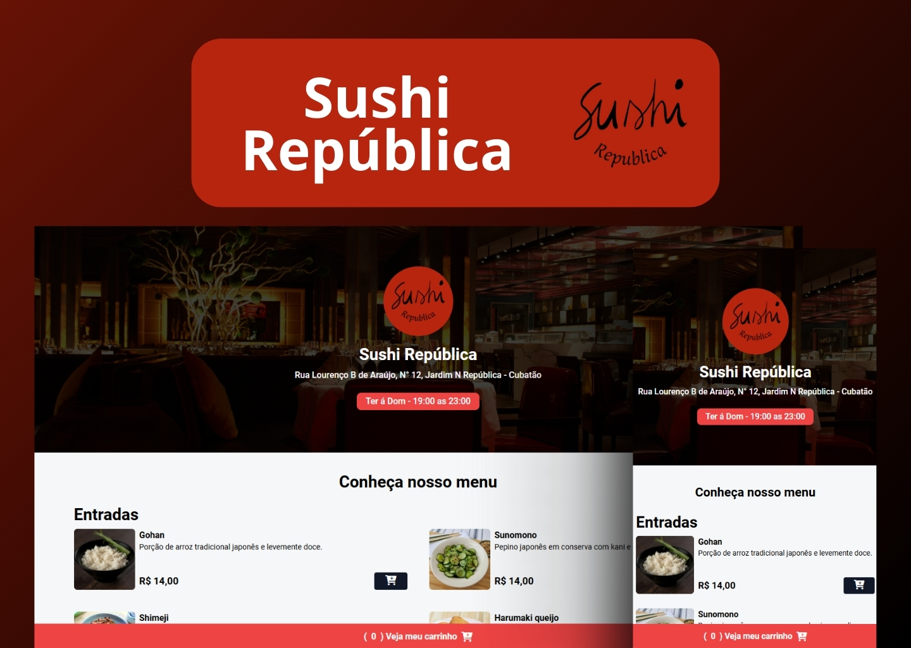

<h1 align="center"> Cardapio Sushi República </h1>

Cardapio Sushi da República para melhorar e agilizar o atendimento online!

  <a href="#-tecnologias">Tecnologias</a>&nbsp;&nbsp;&nbsp;|&nbsp;&nbsp;&nbsp;
  <a href="#-projeto">Projeto</a>&nbsp;&nbsp;&nbsp;|&nbsp;&nbsp;&nbsp;

 

  

## 🚀 Tecnologias

Esse projeto foi desenvolvido com as seguintes tecnologias:

- HTML e CSS
- JavaScript
- Git e Github
- Tailwind

## 💻 Projeto

Apresento o Cardápio Digital do Sushi da República, uma maneira prática e moderna de explorar as delícias da culinária japonesa. Com ele, você acessa facilmente pratos, combinações e especialidades, tudo diretamente no seu dispositivo. Ideal para tornar sua experiência mais rápida e interativa, seja para pedidos em casa ou no restaurante.

---

Feito por Riquelme Guedes